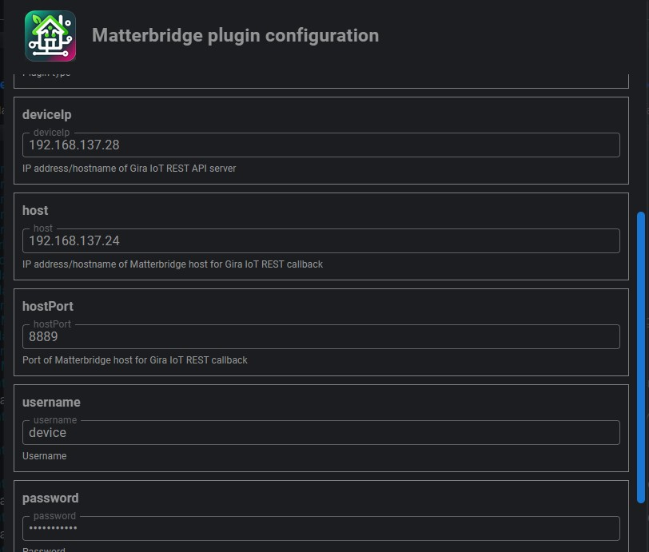
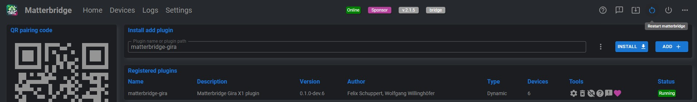
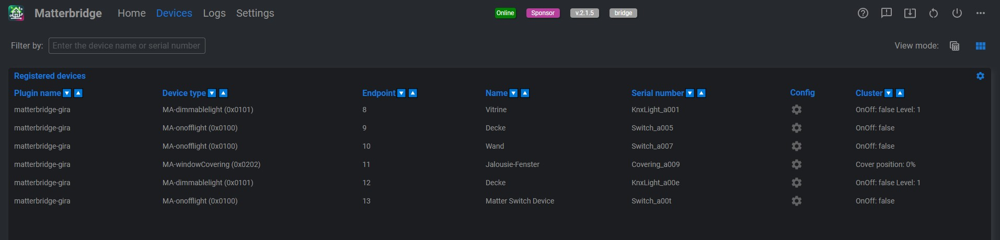

# &nbsp;&nbsp;&nbsp;Matterbridge plugin for Gira IoT REST API

Matterbridge plugin for Gira IoT REST API can be used with the folling Gira Server Product

| Gira Product     | Verified |
| ------------------ | ------------- |
| Gira X1 Server   | ✔️          |
| Gira HomeServer  | ✔️          |
| Gira One Server  | No        |
| Gira eNet Server | No        |

## Installation notes

### Native Node.js based installation

Requirements:

* Node.js > 20.18.3

Follow these steps to install Matterbridge:

```
npm install -g matterbridge --omit=dev
```

Run the installation with:

```
matterbridge
```

install matterbridge-gira plug in:


open matterbrige-gira plugin configuration dialog:


configure matterbridge-gia plugin:



save configuration changes and restart matterbridge:



after restart check discovered devices:



### Home Assistant

ATTENTION: Currently Home Assistant official Matterbridge Add-on can not be used for matterbrigde-gira Plugin because there is currently no way to add an additional port for Gira IoT Rest API Callback.

1. Install official Matterbridge Home Assistant Add-on ([link](https://github.com/Luligu/matterbridge-home-assistant-addon))
   
   Make sure to enable the option to view the Matterbridge website.
2. ....

## Supported function types

| Function name     | Function URN                          | Matter mapping | Status | Remark |
| ------------------- | --------------------------------------- | ---------------- | :------------------------------ |  -------------- |
| Switched light    | de.gira.schema.functions.Switch       | Light on/off   | ✔️                          |
| Dimmer            | de.gira.schema.functions.KNX.Light    | Dimmable Light | ✔️                          |
| Colored light     | de.gira.schema.functions.ColoredLight |                |                               |
| Tunable white     | de.gira.schema.functions.TunalbeLight |                |                               |
| Shutter and Blind | de.gira.schema.functions.Covering     | Cover          | ✔️  | (no slats supported yet) |

